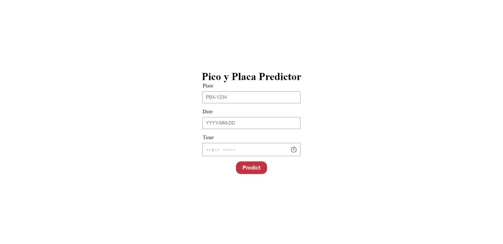
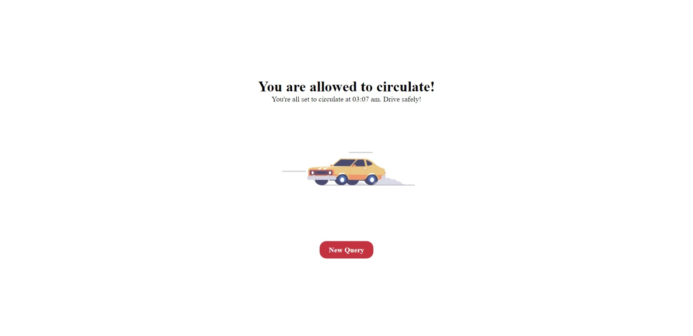
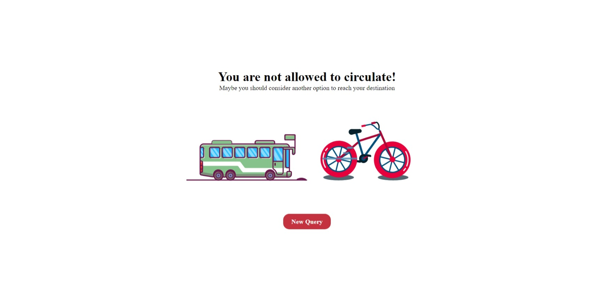

# Pico y Placa Predictor

## Project Description

A Pico y Placa predictor for Quito, Ecuador based on 3 parameters: license plate, date and time. It specifically uses the past rules of Pico y Placa (Hours: 7:00 am - 9:30 am / 4:00 pm - 7:30 pm)

## Live Preview

You can preview the page live with the button below:

[](https://chuviil.github.io/Pico-Placa-Predictor/)

You can also follow the [Installation](#installation) below to run it locally.

## Pages

- **Home Page** Allows users to input information for prediction (Plate, Date, Time)

- **Results Page** Displays data based on user input letting the user know whether he can or not circulate.

## Screenshots





## Installation

1. Clone the repository

```bash
git clone https://github.com/Chuviil/Pico-Placa-Predictor.git
```

2. Navigate to the project directory

```bash
cd PICO-PLACA-PREDICTOR
```

3. Install dependencies

```bash
npm install
```

4. Run the development server
```bash
npm run dev
```

5. Open your browser and navigate to http://localhost:5173/Pico-Placa-Predictor/

## Executing tests

1. Run the `test` script

```bash
npm run test
```

## Tech Stack + Features

### Frameworks
- [React.js](https://react.dev/) - JavaScript library for building user interfaces, particularly single-page applications where components efficiently update in response to data changes.
- [Vitest](https://vitest.dev/) - Vite-native Next Generation testing framework

### Tools
- [Vite](https://vitejs.dev/) - Modern frontend build tool that focuses on fast development and serves as a development server, bundler, and build tool for web applications

### Utilities
- `isAllowedToCirculate` Determines whether a vehicle is allowed to circulate based on Pico y Placa restrictions.
- `isPlate` Validation function to determine whether a string is or not a valid license plate in a format ABC-1234.
- `isDate` Validation function to determine whether a string is or not a valid date string in a format YYYY-MM-DD.
- `isTime` Validation function to determine whether a string is or not a valid time in a format HH:mm.

## Author

- Sebastián Quito ([chuviil](https://github.com/Chuviil))
